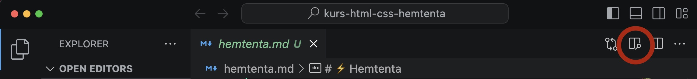

[](https://classroom.github.com/a/Tw1TFTlo)
[](https://classroom.github.com/online_ide?assignment_repo_id=12690262&assignment_repo_type=AssignmentRepo)

# ⚡️ Hemtenta

## 📝 Instruktioner

- Hemtentan lämnas in senast vid den tidpunkten som finns angiven på itslearning och/eller i inlämningsuppgiften. Inskickade svar via Teams, itslearning eller motsvarande accepteras inte.

- Skriv svaren direkt i denna markdown-fil, och committa.

- Om du använder VS Code så kan du förhandsgranska Markdown-filen med hjälp av denna ikon: 

Frågorna är strukturerade enligt följande format i dokumentet, och du skriver ditt svar genom att inleda med en s.k. "krokodilkäft", se nedan:

---

### Frågans titel

1. attribut
   > mitt svar skriver jag här

---

- Betrakta även tentatillfället som en möjlighet att _lära sig något_, och inte enbart som en kunskapskontroll. Glöm alla principer från tidigare skolgång om examination; det går inte att applicera på kod (tycker jag).
- På samtliga frågor, svara _med egna ord_. Jag vill inte ha inklistrade svar från Wikipedia eller motsvarande.
- Om någon beskrivning/fråga är oklar - skriv hur du har tolkat den! Det löser sig 🚑️
- Tentan kan totalt ge 59 ⭐ (poäng) och för G krävs 60 % (35 st) och för VG 80 % (47 st).
- Du kan öppna denna fil i t.ex. Visual Studio Code, och bör då få upp en förhandsgranskning om du upplever det textbaserade filformatet besvärligt att läsa :)
- 💥 Läs igenom _alla_ frågorna innan du sätter igång med att svara, så vet du vilka som kommer att ta längre tid, och vilka som tar kortare tid.

## 🧑‍💻 Frågor

### 1. Semantik (5 ⭐)

- Vad innebär "semantik" som begrepp (i HTML)?

  > Inom HTML (Hyper Text Markup Language) refererar semantik till användningen av HTML-element på ett sådant sätt att de ger en meningsfull struktur och betydelse åt innehållet på webbsidan. Semantik handlar om att använda rätt HTML-element för att beskriva innehållet på webbsidan och dess hierarki. Några fördelar med att använda sig av semantik är: förbättrad SEO, bättre tillgänglighet, och lättare underhåll och utveckling

- Varför ska det användas på webbplatser utifrån ett utvecklarperspektiv?

  > Från ett utvecklarperspektiv, semantiska element kan göra det lättare att förstå hur en webbplats är uppbyggd och hur den fungerar. Detta kan göra det lättare att underhålla och utveckla webbplatsen. Semantiska element kan användas för att enklare identifiera olika delar av en webbplats, till exempel huvudinnehållet, sidoinnehållet och sidofoten.

- Ge ett exempel vardera på hur semantik påverkar (1) tillgänglighet, (2) SEO och (3) kodgranskning/samarbete.

  > **(1) Tillgängliget:** En webbplats som använder sig av semantiska element för att till exempel beskriva rubriker och andra viktiga delar av innehållet kan göra det lättare för personer med funktionsnedsättningar att förstå innehållet. Till exempel kan en webbläsare för personer med synnedsättning använda sig av sematiska element för att läsa upp rubriker och andra viktiga delar av innehållet. Detta kan hjälpa användare att navigera på webbplatsen och förstå innehållet bättre. **(2) SEO:** Användningen av semantiska element för att beskriva en wepplats innehåll på ett korrekt sätt kan underlätta för sökmotorer att förstå innehållet. Detta kan leda till att webbplatsen rankas högre i sökresultaten. Till exempel kan sökrobotar använda sig av semantiska element för att identifiera huvudinnehållet på en webbsida. **(3) Kodgranskning/samarbete:** Genom att använda sig av semantiska element kan utvecklare snabbt identifiera olika delar av en webbsida. Detta underlättar även vid samarbeten då det blir lättare att förstå vilka delar som utveklarna refererar till.

### 2. Semantik (3 ⭐)

Välj ut en valfri sajt som _inte_ är en tidningssida eller någonting som du själv har gjort. Ta en skärmdump på den primära delen av sidan (= det som syns på din skärm när du surfar in på sidan). Beskriv hur du hade strukturerat upp den i block och vilka semantiska taggar du hade använt. Du kan t.ex. använda rutor med siffror för att koppla ihop dina förklaringar.

Se referensbild nedan.


### 3. Terminologi 1 (10 ⭐)

Beskriv med egna ord vad följande saker är:

1. attribut

   > HTML-attribut är använda för att tillför extra information till HTML-element. Alla HTML element kan ha attribut, och dessa attribut specificeras i "starttagen" (ofta kallad "öppningstaggen") av elementet. Attributen kommer vanligtvis i namn/värdepar som: name="value".

2. pseudo selector

   > Pseudo selector används för att definiera specifika tillstånd av ett element och är särskillt användbara för att styra elementets utseende och beteende baserat på användarinteraktion och andra kriterier. Ett tydligt exempel är ":hover" som gör det möjligt att ändra stylingen när användaren för sin muspekare över ett element, vilket ger visuell feedback.

3. parent i DOM

   > I DOM (Document Object Model) representerar "parent" det överordnade eller förälderelementet i trädstrukturen av HTML. Parent-elementet är det element som innehåller ett eller flera element, kallat "child" eller "children".

4. sibling (i DOM)

   > Siblings är syskon-element som befinner sig på samma nivå i DOM-trädet och som delar samma förälder (parent). Med andra ord, syskon-element är placerade vid varandra och de delar samma förälder.

5. child (i DOM)

   > Child element är de element som är direkt inbäddaded inuti ett specifikt förälderelement. I DOM-hierarkin blir varje element som placeras inuti ett annat element automatiskt ett child element av det förälder-elementet. Detta gäller för alla element som är inbäddade inuti andra element. När ett element innehåller ett annat element, skapas ett tydligt förälder/barn-förhållande, där det yttre elementet är förälder och det inre elementet är barn.

6. child och sibling selectors i CSS

   > Child-selectorer och sibling-selectorer i CSS är två typer av selektorer som används för att rikta in sig på specifika element i en webbsida baserat på deras relation till andra element. Child-selectorn (">") i CSS används för att välja alla direkta barn av ett specifikt överordnat element. Adjecent sibling-selectorn ("+") i CSS används för att välja det första syskonet som är direkt efter ett specifikt element. General sibling-selectorn ("~") i CSS används för att välja alla syskon som delar samma förälder som ett specifikt element, det behöver inte vara direkt barn till det specifika elementet.

7. URL

   > URL (Uniform Resource Locator) är den sträng av tecken som används i webbläsarens adressfält för att navigera till en specifik webbsida eller hämta en specifik resurs.

8. domän

   > Ett domännamn (kallas oftast för domän) är ett namn som är lätt att komma ihåg och som är kopplat till en IP-adress på internet. Vi använder oss av domäner då vi människor har lättare för att komma ihåg ord än sifferkombinationer. Domänändelse är den sista delen av domänen (.com, .se, .org mm) och indikerar ofta vilken slags organisation eller typ av webbplats det är. Exempel: **Domännamn**: "google" och **Domänändelse:** ".com".

9. DNS

   > DNS (Domain Name System) kan liknas med en telefonkatalog som översätter namn till telefonnummer. Likt telefonkatalogen så översätter DNS domäner till ip-addresser. Domännamn används för att översätta IP-adresser till mänskligt läsbara och minnesvärda namn. Det är enklare att komma ihåg "www.google.com" än deras ip-address "142.250.189.196".

10. a11y

    > A11y är en förkortning av "accessibility" på engelska där siffan 11 representerar de 11 bokstäverna mellan "a" och "y". A11y används för att referera till en webbplats eller webbapplikations tillgänglighet för personer med funktionsnedsättningar. Tillgänglighet handlar om att skapa webbsidor och applikationer som kan användas och förstås av alla, oavsett funktionsnedsättning.

### 4. Tillgänglighet (5 ⭐)

Gör en övergripande tillgänglighetsanalys på https://www.lingscars.com. Nämn 5 saker som behöver förbättras.

> Testet utfört i Firefox och Chrome **(1)** Ensure text remains visible during webfont load **(2)** Uppfyller inte WCAG-standarderna för tillgänglig text **(3)** Eliminate render-blocking resources **(4)** Properly size images **(5)** Image elements do not have explicit width and height

### 5. Optimering (6 ⭐)

Beskriv syftet med följande (dvs. varför det görs/vad det används till):

- Komprimera (minifiera) Sass-kod (compress)

  > Syftet med att komprimera (minifiera) Sass-kod är att minska filens storlek och därigenom förbättra prestanda och snabbhet när den laddas in på en webbsida.

- Använda resurser från externa (CDN-)källor, t.ex. Google Fonts, istället för att ladda ner typsnitt.

  > Syftet med att använda sig av externa källor är för att förbättra prestandan och tillgängliheten för webbplatser. Typsnittsfiler kan vara relativt stora och det kan ta tid att ladda ner de. Genom att använda oss av CDN (Content delivery network) kan vi ladda in typsnittsfilerna från en server som är placerad i närheten av användaren, vilket förbättrar prestandan och kan ge en förbättrad användarupplevelse. Användingen av CDN gör det enklare att underhålla webbplatsen och säkerställa att typsnitten är tillgängliga för alla användare.

- Lighthouse

  > Lighthouse är ett verktyg för utvecklare som kan hjälpa till de med att identifiera och åtgärda eventuella problem. Lighthouse kör en serie granskningar mot sidan och genererar sedan en rapport om hur väl sidan presterade. Utvecklaren kan få en övergrippande bild över följande; Performance, Accessibility, Best practices, SEO och PWA. Detta verktyg gör det möjligt för utvecklare att upptäcka saker som de möjligtvis har missat.

### 6. Bilder (4 ⭐)

Förklara följande:

1. Varför används attributet `loading="lazy"` i HTML på vissa bilder?

   > Genom att använda oss av 'loading="lazy"' instruerar vi webbläsaren att ladda in bilderna först när bilden är på väg att komma in i användarens vyport eller när den är nära att bläddras in i vyporten. Detta hjälper till att minska onödiga nätverksförfrågningar och spara bandbredd, vilket resulterar i snabbare laddningstider och förbättrad prestanda.

2. Vad gör motsvarande attribut `loading="eager"` i HTML?

   > Genom att använda oss av 'loading="eager"' instruerar vi webbläsaren att ladda in resurserna omedelbart när sidan läses in, utan att vänta på att den blir synlig i användarens vyport. Detta kan vara bra för viktiga resurser som behöver vara tillgängliga omedelbart för användaren.

3. Utöver tillgänglighetsaspekten, varför bör du sätta ett `alt`-attribut på bilder?

   > Att använda sig av 'alt'-attribut på bilder kan hjälpa till med sökmotoroptimeringen. Detta kan göra det möjligt för sökmotorer att förstå vad bilderna handlar om och inkludera dem i relevanta sökresultat. För användare med begränsad internetuppkoppling kan dessa beskrivande texter ge en kontext om vad bilden föreställer.

4. Att sätta `width` och `height` som attribut i HTML-koden på bilder, vad bidrar det till?

   > Genom att använda oss av "width" och "height" gör vi det möjligt för webbläsaren att reservera ett visst utrymmer för bilderna medan sidan laddas. Om vi inte anger dessa attribut kan webbläsaren inte förutsäga bildens storlek, vilket kan leda till att sidans layout "hoppar" när bilden laddas. Detta kan vara förvirrande och distraherande för användaren.

### 7. Ramverk (4 ⭐)

Lista:

1. Två stycken kända CSS-ramverk/-bibliotek/-"helpers"

   > **(1)** Tailwind CSS **(2)** Bootstrap

2. Ett känt HTML-template som man kan starta sina projekt utifrån

   > HTML5 Boilerplate

3. Nämn en bra sajt där du kan hålla koll på CSS-trender

   > Mozilla Developer Network

### 8. Sass (5 ⭐)

Förklara följande koncept i Sass (bonusfråga):

1. mixin

   > Mixins kan användas för att återanvända komplexa stilar eller stilar som kräver anpassning. De kan användas för att definiera en grupp av stilar som sedan kan användas i andra stilar.

2. lists

   > En SASS lista kan användas för att lagra en samling av värden. Listor kan innehålla alla typer av värden, inklusive strängar, tal, variabler och andra listor

3. function

   > I Sass används funktioner till att organisera kod och utföra återkommande beräkningar och operationer på ett enkelt och återanvändbart sätt. De hjälper till att organisera och effektivisera CSS-koden genom att hantera komplexa uppgifter som matematik och färgmanipulation.

4. partials

   > Partials består av delar av SASS-kod. Dessa partials sparas vanligtvis i filer som börjar med ett understreck och har filändelsen .scss eller .sass. De används för att bryta upp CSS-kod i mindre, mer hanterbara delar, vilket gör det lättare att organisera och underhålla en kodbas.

5. variables
   > Det är namngivna platshållare för att lagra och återanvända värden, som färger, textsträngar eller numeriska värden.

### 9. Tillgänglighet (10 ⭐)

Besvara följande frågor:

1. När ska du använda ARIA labels?

   > ARIA (Accessible Rich Internet Applications) används för att beskriva vad ett element gör då html elementen i sig inte alltid kommer räcka till. Det är en uppsättning roller och attribut som definierar sätt att göra webbinnehåll och webbapplikationer (särskilt de som utvecklats med JavaScript) mer tillgängliga för personer med funktionsnedsättningar.

2. Vad är den minsta rekommenderade storleken på ett interaktivt element, t.ex. en knapp, på en liten skärm (t.ex. mobil) i pixlar?

   > 44px \* 44px

3. Vad är den minsta rekommenderade font-storleken i pixlar?

   > 12 pixlar

4. Varför ska du använda t.ex. `rem` eller `em` som enhet på fonter istället för pixlar?

   > Att använda sig av relativa enheter som rem eller em istället för fasta pixlar (px) i webbutveckling erbjuder flera fördelar. Dessa enheter ger skalbarhet och flexibilitet, vilket möjliggör en enhetlig och responsiv textstorlek oavsett skärmstorlek. De förbättrar också tillgängligheten genom att ge användarna möjlighet att anpassa textstorleken enligt deras preferenser.

5. Vilken tillgänglighetsnivå (A) ska du eftersträva minst för publika sidor, t.ex. myndighetssidor?

   > AA

6. Vilken myndighet i Sverige ansvarar för tillgänglighet?

   > DIGG - Myndigheten För Digital Förvaltning

7. Du skapar en knapp med hjälp av ett div-element. Beskriv problematiken i detta.

   > Att använda siv av "div"-element istället för ett dedikerat "button"-element när vi skapar en knapp kan medföra flera problem. Det främsta är att semantiken blir fel och vi förlorar tillgängligheten och användarupplevelsen. Genom att till exempel använda "button" kan vi säkerställa att knappen har rätt betydelse och funktionalitet, samtidigt som vi kan dra nytta av inbyggd stöd för tillgänglighet och enklare styling och interaktioner.

8. Vem är ansvarig för att tabindex sätts på interaktiva element och att det sker i rätt ordning?

   > Utvecklaren för webbsidan.

9. Skriv en alt-text till följande bild, på svenska, engelska eller finska. 

   > En färgsprakande filmaffisch från 1971 om La Naranja Mecanica, regisserad av Stanley Kubrick och med Malcolm McDowell & Patrick Magee i huvudrollerna

10. Du har lagt in hysteriska animationer på din sida. Vilken media query använder du för att avaktivera dessa för användare som inte vill ha animationer?

```
@media (prefers-reduced-motion: reduce) {
    .hysteriska-animationer {
        animation: none;
    }
}
```

### 10. Sökmotoroptimering (7 ⭐)

Kantarella Löfwenskog har som målsättning att bli Sveriges största influerare och bloggare inom all form av skogskost och att ge sina läsare tips på hur man blir, är och hur det är att vara självförsörjande, mediterande skogsmulle.

Du jobbar på webbyrån Undermålig AB som Front End-utvecklare, och chefen har sagt åt dig att fixa fram 5 tips som får Kantarellas sajt att hamna högre upp i sökträffarna.

Kantarellas sajt har precis lanserats, och det finns i dagsläget 5 st blogginlägg och en "Om Kantarella"-sida.

Vilka fem saker gör du?

```
1. Kollar så att det finns semantiska html element.
2. Går igenom texterna för att se om där finns starka keywords.
3. Ser över namnen på länkarna, att länkarna matchar innehållet.
4. Ser till att den är tillgänglighetsoptimerad.
5. Ser till att den är mobilanpassad för att nå ut till en bredare publik.
```
